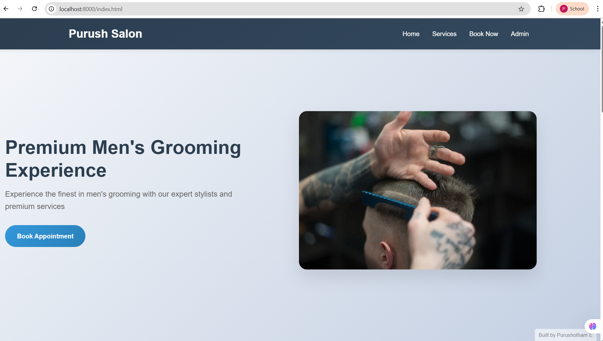
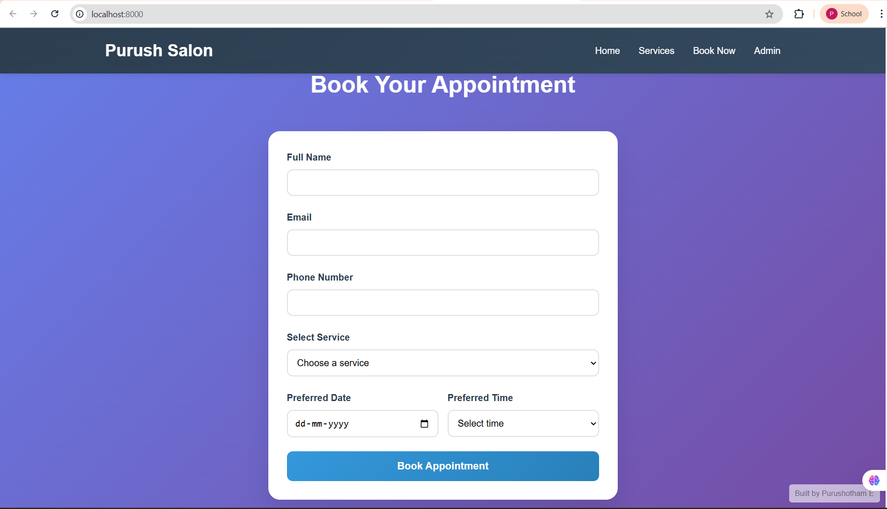
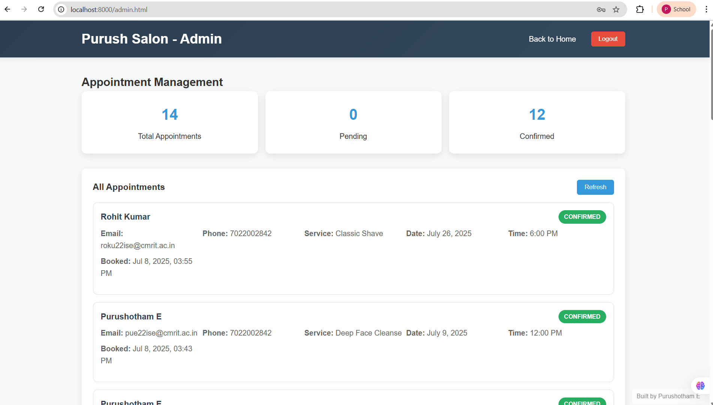

# 💇‍♂️ Salon Appointment Management System

A full-stack web application for booking, managing, and tracking salon appointments.

---

## 🌟 Features

### 👥 User Side
- 📅 Book appointments with name, email, phone, date, time, and service
- 📧 Receive confirmation or rejection emails

### 🧑‍💼 Admin Side
- 🔐 Secure admin login (credentials stored via environment variables)
- 📊 View dashboard with all appointments: pending, confirmed, rejected
- ✅ One-click approval/rejection
- 📈 Statistics panel showing totals

---

## 🧰 Tech Stack

| Layer     | Technology            |
|-----------|------------------------|
| Backend   | Node.js, Express       |
| Database  | SQLite                 |
| Frontend  | HTML, CSS, JavaScript  |
| Email     | Nodemailer + Gmail App Password |

---

## 📸 Screenshots

> 📌 All screenshots are located in the `client/screenshots/` folder.

### 🏠 Home Page


### 📅 Booking Page


### 🧑‍💼 Admin Panel


---

## 🛠️ Getting Started

### 🔧 Prerequisites
- Node.js (v18+)
- Gmail account with App Password enabled

### 📦 Installation

```bash
git clone https://github.com/yourusername/salon-appointment-system.git
cd salon-appointment-system
npm install
```

### 🔐 Environment Setup

Create a `.env` file in the root directory:

```env
EMAIL_USER=yourgmail@gmail.com
EMAIL_PASS=yourapppassword
ADMIN_USER=youradminusername
ADMIN_PASS=youradminpassword
```

> ⚠️ Don’t commit your `.env` file. It should be listed in `.gitignore`.

---

### ▶️ Run the Application

```bash
node server.js
```

Then open: [http://localhost:8000](http://localhost:8000)

---

## 📂 Folder Structure

```
salon-appointment-system/
├── client/
│   ├── screenshots/         # Project screenshots (home.png, etc.)
│   ├── src/
│   │   ├── components/
│   │   ├── contexts/
│   │   ├── pages/
│   │   ├── App.jsx
│   │   ├── main.jsx
│   │   └── index.css
│   ├── index.html
│   ├── package.json
│   └── vite.config.js
├── admin.html               # Admin dashboard UI
├── index.html               # Booking form UI
├── admin.js                 # Admin dashboard JS logic
├── script.js                # Client-side booking logic
├── server.js                # Node.js backend (Express)
├── salon.db                 # SQLite database (auto-generated)
├── .env                     # Environment variables
├── .gitignore               # Git ignore file
└── README.md                # Project description
```

---

## ✉️ Email Configuration Notes

- Gmail must have **2-Factor Authentication** enabled
- Generate a Gmail **App Password**:  
  👉 [https://myaccount.google.com/apppasswords](https://myaccount.google.com/apppasswords)

---

## 💡 Future Enhancements

- 🔐 JWT-based authentication
- 📱 SMS notifications via Twilio
- 🧾 Appointment summary emails
- 🎨 UI enhancement using TailwindCSS or Bootstrap
- 🌐 Cloud database (e.g., MongoDB, PostgreSQL)

---

## 🤝 Contributing

Pull requests are welcome!

1. Fork the repository  
2. Create a feature branch (`feature/your-feature`)  
3. Commit changes and push  
4. Open a Pull Request  

---

## 📄 License

This project is licensed under the [MIT License](LICENSE)

---

## 📊 GitHub Stats

## 📊 GitHub Stats

## 📊 GitHub Stats

  
  


